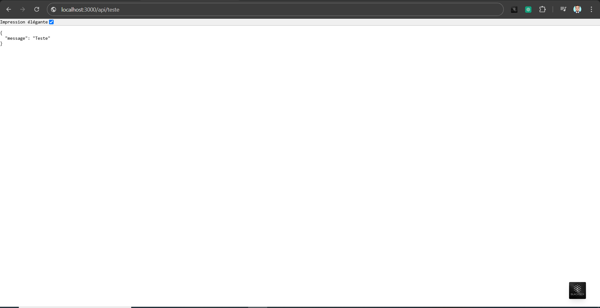
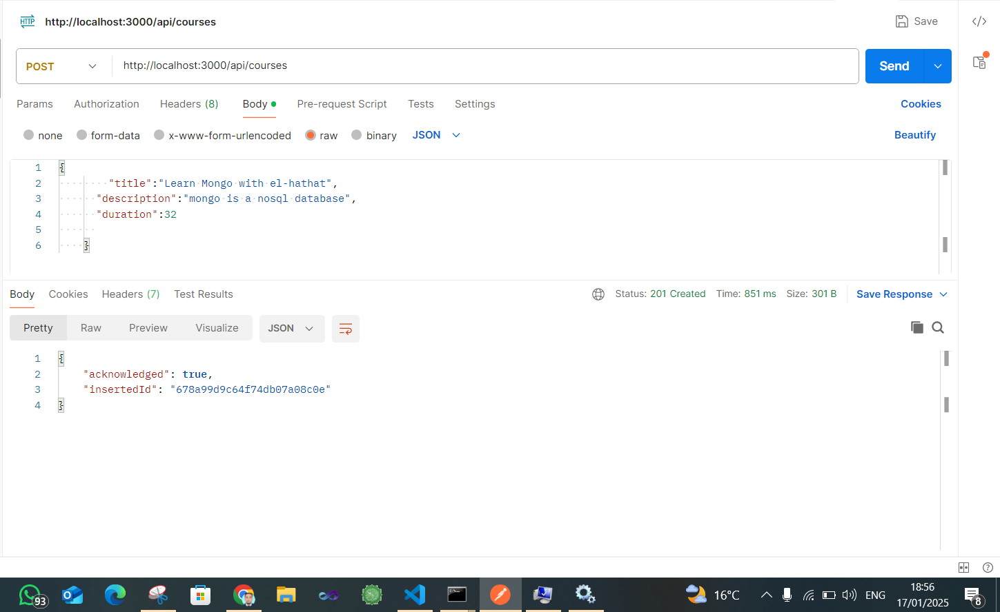
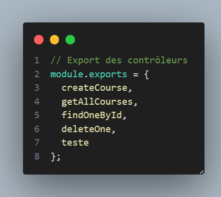
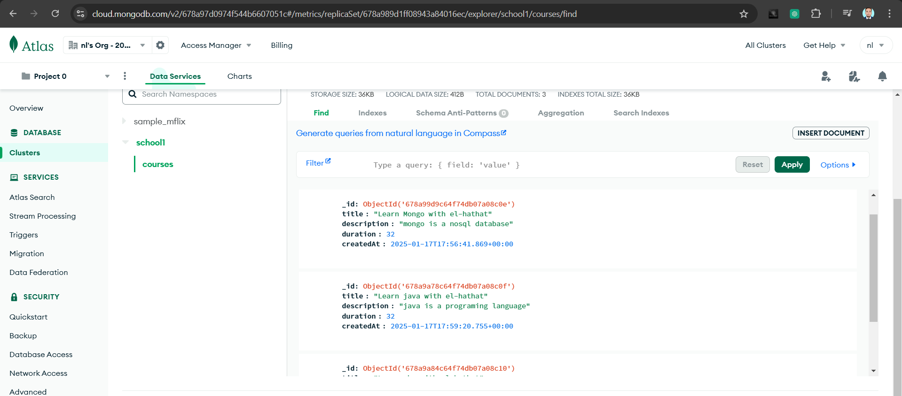

  # **El-hathat Mohamed**
  # **BDCC**
  # **Num : 15**

## **TAF**

### Pour le rendu, voici ce que j'attends :
1. Un dépôt public sur Github avec un historique de commits clair
2. Un README.md qui explique :
   - Comment installer et lancer le projet
   - La structure du projet
   - Les choix techniques que vous avez faits
   - Les réponses aux questions posées dans les commentaires
3. Le code complété avec tous les TODOs implémentés

## **Reponses**

#### **db.js**
 Question : Pourquoi créer un module séparé pour les connexions aux bases de données ?

 Réponse : Pour séparer les responsabilités et faciliter la gestion des connexions.

 Question : Comment gérer proprement la fermeture des connexions ?

 Réponse : En utilisant des fonctions pour ouvrir et fermer les connexions.

#### **env.js**
 Question: Pourquoi est-il important de valider les variables d'environnement au démarrage ?

 Réponse : Pour éviter les erreurs et les comportements inattendus.

 Question: Que se passe-t-il si une variable requise est manquante ?

 Réponse : Une erreur est levée pour signaler le problème.

#### **courseController.js**
 Question: Quelle est la différence entre un contrôleur et une route ?

 Réponse: Un contrôleur contient la logique métier tandis qu'une route définit les points d'entrée de l'API.

 Question : Pourquoi séparer la logique métier des routes ?

 Réponse : Pour rendre le code plus modulaire et facile à tester.

#### **courseRoutes.js**
 Question: Pourquoi séparer les routes dans différents fichiers ?

 Réponse : Pour organiser et structurer le code de manière modulaire.

 Question : Comment organiser les routes de manière cohérente ?

 Réponse: En regroupant les routes par fonctionnalité ou ressource.

#### **mongoServices.js**
 Question: Pourquoi créer des services séparés ?

 Réponse: Pour réutiliser la logique métier et séparer les responsabilités.

#### **redisServices.js**
 Question : Comment gérer efficacement le cache avec Redis ?

 Réponse : En utilisant des fonctions utilitaires pour le cache.

 Question: Quelles sont les bonnes pratiques pour les clés Redis ?
 
 Réponse : Utiliser des clés explicites et uniques pour chaque donnée.

#### **app.js**
 Question: Comment organiser le point d'entrée de l'application ?
 
 Réponse : En regroupant les routes et les middlewares dans un seul fichier.
 
 Question: Quelle est la meilleure façon de gérer le démarrage de l'application ?
 
 Réponse : En utilisant une fonction asynchrone pour initialiser les connexions et démarrer le serveur.

 #### **.env**
 Question: Quelles sont les informations sensibles à ne jamais commiter ?
 
 Réponse : Les informations sensibles à ne jamais commiter sont les clés d'API, les mots de passe, les tokens, les identifiants, 
 les informations de connexion, les informations de paiement, les informations de sécurité, les informations de configuration, les informations de déploiement, les informations de production, les informations de développement, les informations de test, les informations de staging, les informations de pré-production, les informations de post-production, les informations de monitoring, les informations de logging, les informations de traçabilité, les informations de journalisation, les informations de débogage, les informations de profiling, les informations de benchmarking, les informations de performance, les informations de qualité, les informations de sécurité, les informations de confidentialité, les informations de conformité, les informations de gouvernance, les informations de réglementation, les informations de législation, les informations de normes, les informations de standards.

 Question: Pourquoi utiliser des variables d'environnement ?

 Réponse : Les variables d'environnement sont utilisées pour stocker des informations sensibles et des configurations spécifiques à l'environnement de développement, de test, de staging, de production, de pré-production, de post-production, de monitoring, de logging, de traçabilité, de journalisation, de débogage, de profiling, de benchmarking, de performance, de qualité, de sécurité, de confidentialité, de conformité, de gouvernance, de réglementation, de législation, de normes, de standards.


 ## **-----------------------------------------------------------------------------------------------**
 ## **Instructions pour Exécuter le Projet**

1. **Installer les dépendances :**
   ```sh
   npm install
2. **Démarrer le serveur :**
   ```sh
   npm start

2. **TESTES :**
   # *tester la fonctionnement du api par une methode teste()*
   

    # *teste d'ajout un cours sur la collection Courses << j'ai utilise postman comme outil de teste*
   

   # *tous ces fonctions fonctionne d'une maniere efficace*
   

      # *testes les fonctions avec mongodb Atlass*
   


   ## **Structure du projet**
La structure du projet est organisée de manière modulaire pour séparer les responsabilités et faciliter la maintenance du code. Voici un aperçu de la structure des dossiers et des fichiers :

```sh
learning-platform-nosql/
├── src/
│   ├── config/
│   │   ├── db.js                # Configuration et connexion à la base de données
│   │   ├── env.js               # Gestion des variables d'environnement
│   ├── controllers/
│   │   ├── courseController.js  # Logique métier pour les cours
│   ├── routes/
│   │   ├── courseRoutes.js      # Définition des routes pour les cours
│   ├── services/
│   │   ├── mongoService.js      # Services pour les opérations MongoDB
│   │   ├── redisService.js      # Services pour les opérations Redis
│   ├── models/
│   │   ├── Course.js            # Modèle de données pour les cours (si nécessaire)
│   ├── app.js                   # Point d'entrée principal de l'application
├── .env                         # Fichier de configuration des variables d'environnement
├── .gitignore                   # Fichier pour ignorer les fichiers et dossiers spécifiques dans Git
├── package.json                 # Fichier de configuration du projet Node.js
├── README.md                    # Documentation du projet

```

## **Détails des dossiers et fichiers**
# src/config/ :

db.js : Gère la connexion à la base de données MongoDB.
env.js : Gère les variables d'environnement.
# src/controllers/ :

courseController.js : Contient la logique métier pour les opérations sur les cours (création, récupération, mise à jour, suppression).
# src/routes/ :

courseRoutes.js : Définit les routes de l'API pour les opérations sur les cours.
# src/services/ :

mongoService.js : Fournit des fonctions réutilisables pour les opérations MongoDB.
redisService.js : Fournit des fonctions réutilisables pour les opérations Redis.
# src/models/ :

Course.js : Définit le modèle de données pour les cours (si nécessaire).
app.js : Point d'entrée principal de l'application. Configure et démarre le serveur Express.

.env : Fichier de configuration des variables d'environnement. Contient les informations de connexion à MongoDB, Redis, et le port du serveur.

.gitignore : Fichier pour ignorer les fichiers et dossiers spécifiques dans Git.

package.json : Fichier de configuration du projet Node.js. Contient les dépendances et les scripts de démarrage.

README.md : Documentation du projet. Contient des instructions sur l'installation, le lancement et la structure du projet.

## ** Choix techniques**
Utilisation de MongoDB pour la base de données NoSQL.
Utilisation de Redis pour la mise en cache.
Séparation des responsabilités en utilisant des contrôleurs, des services et des routes.
Utilisation des variables d'environnement pour la configuration.


### infos sur repo :
1. *remote* : origin1
2. *branch* : master
